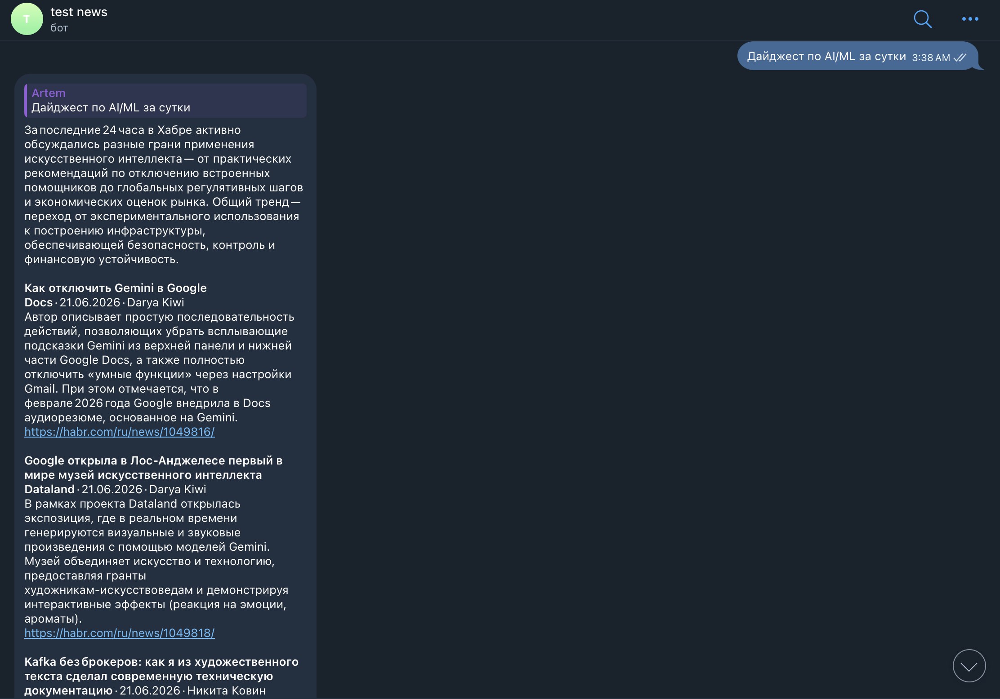
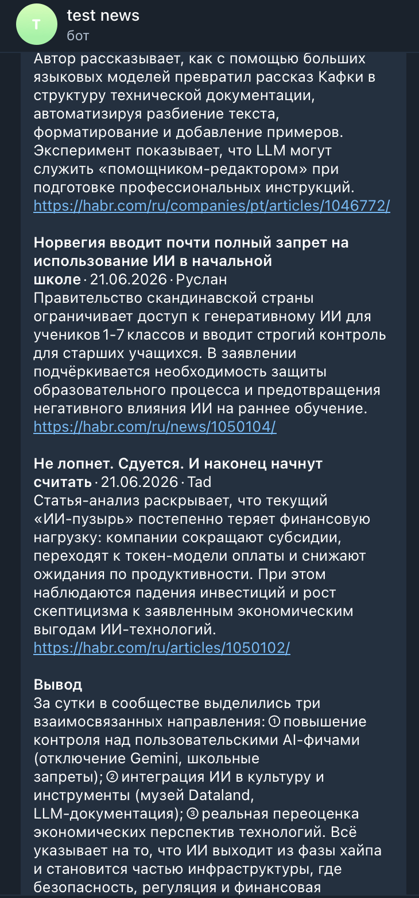

# News Digest Agent (Hermes + MCP) — Level 2

Агент по запросу из Telegram собирает дайджест новостей с Хабра за указанный
период по заданной теме, аннотирует статьи и присылает обратно связную
обзорную статью на русском.

Пример запроса:
> Собери дайджест по теме «AI / ML» за последнюю неделю

## Архитектура

```
Telegram ──► Hermes Agent ──► skill: news-digest   (КАК собрать дайджест)
                  │
                  └──► MCP: mcp-news (http)         (ОТКУДА брать данные)
                          ├─ search_habr(query, period, limit)
                          └─ fetch_article(url)
```

- **MCP (`mcp-news`)** — доступ к данным за период. Python + FastMCP
- **Skill (`news-digest`)** — привычка сборки дайджеста (разбор
  запроса, порядок вызова инструментов, дедупликация, структура вводка→пункты→вывод, тон).
- **Hermes Agent** — слушает Telegram, использует инструменты MCP, пишет ответ.

## Стек

- Hermes Agent — https://github.com/nousresearch/hermes-agent
- LLM: через **OpenRouter** использовалась бесплатная модель `openai/gpt-oss-120b:free` (требование — поддержка
  function calling).
- MCP-сервер: Python 3.12, FastMCP, httpx, trafilatura.
- Источник данных: RSS поиска Хабра (`habr.com/ru/rss/search/posts/`)

## Запуск

```bash
# 1. Получить исходники Hermes (нужны для сборки образа)
git clone https://github.com/nousresearch/hermes-agent.git vendor/hermes-agent

# 2. Заполнить секреты
cp .env.example .env   # вписать свои OPENROUTER_API_KEY, токен бота и telegram user ID

# 3. Поднять оба сервиса
docker compose up --build
```

Где взять значения:
- **Токен бота** — у `@BotFather` в Telegram (`/newbot`)
- **Telegram user ID** — у `@userinfobot` (числовой id, не username)
- **OPENROUTER_API_KEY** — на https://openrouter.ai/keys

## Пример прогона

### Дайджест по AI/ML за сутки



## Известные ограничения

Качество форматирования ответа зависит от используемой LLM. На бесплатных моделях
OpenRouter модель может отступать от шаблона, заданного в skill. При использовании платной,
более дисциплинированной модел, вывод больше следует шаблону.

## Структура

```
news-digest-agent/
├── mcp-news/                        # MCP-сервер
│   ├── server.py                    # search_habr, fetch_article
│   ├── requirements.txt
│   └── Dockerfile
├── hermes/
│   ├── config.yaml                  # model + mcp_servers + настройки Telegram
│   └── skills/news-digest/SKILL.md  # процедура сборки дайджеста
├── examples/                        # примеры полученных дайджестов
├── docker-compose.yml
├── .env.example
├── .gitignore
└── README.md
```